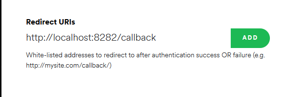

# Spotify-controller 
## About
Spotify-controller is a command line interface for spotify. It uses the web api to send commands to spotify.  

## Setup
### Spotify app
To use this program, you will need a spotify developer account with a web app set up. To do this, visit [https://developer.spotify.com/dashboard/applications](https://developer.spotify.com/dashboard/applications)  
Once you have created a new app, click edit settings and ensure the redirect url is `http://localhost:8282/callback` as shown below  




### Config
To use the app you created, copy the client id and secret to `config.json`

```json
{
    "clientId": "1234",
    "clientSecret": "4321"
}
```

## Usage
To view all available commands, type `help`
```
Available commands are:
pause - Use to pause the music
play - Use to play the music
volume - Use to raise or lower the volume
remove - Removes the currently playing song from the current playlist
add - Adds the currently playing song to a playlist of your choice
shuffle - Randomly shuffles the given playlist
clone - Clones the given playlist to a new playlist with a randomly shuffled order
prev - Skips back to the previous track
duplicate - Removes duplicates from the given playlist
details - Gets the details of the currently playing track
```

## Development
### Prerequisites
* [Go](https://golang.org/)

### Config
When developing, a file `config.dev.json` can be used instead of `config.json` to ensure 
clientId and secret are not tracked in source control

### Running
Run `go run .` inside the root folder

### Build
Run `go build` inside the root folder

